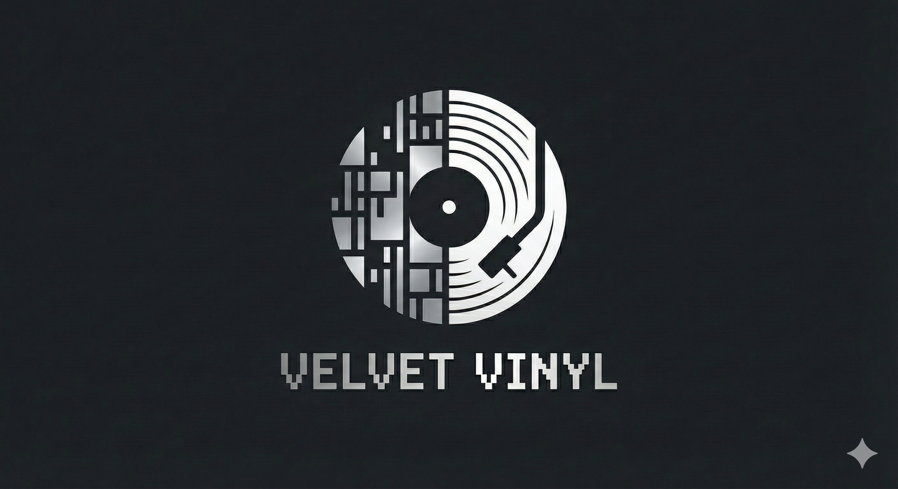

# Velvet Vinyl



An AI-powered voice conversion tool that transforms modern Bollywood songs into the style of legendary singers like Kishore Kumar, Lata Mangeshkar, Asha Bhosle, and Mohammad Rafi.

## Features
- **Vocal Separation**: Automatically separates vocals from instrumentals using Demucs.
- **Voice Conversion**: Converts vocals to the target singer's voice using RVC (Retrieval-based Voice Conversion).
- **Audio Mixing**: Merges the converted vocals back with the original instrumental.

## Setup
1.  Ensure you have the required dependencies installed (see `requirements.txt`).
2.  Place the RVC models (`.pth`) in `RVC_Backend/assets/weights/`.
3.  Place the RVC index files (`.index`) in `RVC_Backend/weights/`.

## Usage
Run the main pipeline:

```powershell
python main.py --input_song "path/to/song.mp3" --target_voice kishore
```

### Arguments
- `--input_song`: Path to the input audio file (mp3/wav).
- `--target_voice`: Target singer. Options: `kishore`, `lata`, `asha`, `rafi`. (Default: `kishore`)
- `--output_dir`: Output directory. (Default: `output`)

## Supported Models
- **Kishore Kumar**: Included/Tested.
- **Lata Mangeshkar**: Supported (requires model file).
- **Asha Bhosle**: Supported (requires model file).
- **Mohammad Rafi**: Supported (requires model file).